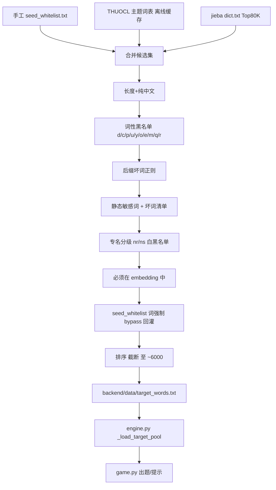

## 用户需求

重构猜词游戏的谜底候选池，从根本上解决当前 `wordlist_top3000.txt` 的三大问题：

1. **该收的没收**：海洋/西瓜/老虎/卫星/巧克力/华为/无人机/深圳/孔子/微信/抖音 等 80+ 高频生活词、新词品牌、广为人知的专名缺失
2. **不该收的混入**：日益/有所/基本上/又称/整整/索性/大面积/一事/浑身/总长/口子/历时/组织法/人口数/总产量 等副词、虚词、不适合猜词的残词混入候选
3. **覆盖面狭窄**：基于 jieba `dict.txt`（偏新闻语料）+ 严格 `{n, vn}` 白名单导致大量日常词、新词、广为人知的专名被双向误处理

## 产品概述

将谜底候选池从"jieba 词典 Top50K + 严格词性白名单"模式，重构为"现代化生活语料种子 + 词性黑名单 + 手工白名单兜底 + 敏感词过滤"模式，并把文件从 `wordlist_top3000.txt` 改名为更合理的 `target_words.txt`。

## 核心特性

- **种子源换血**：以 THUOCL 主题词表（IT、食物、动物、植物、品牌、历史人物等）+ jieba Top80K 共同作为候选源，覆盖现代生活语义
- **过滤逻辑反转**：词性从白名单 `{n, vn}` 改为黑名单（剔除 d/c/p/u/y/o/e/m/q/r 等虚词与代词），同时配合静态坏词清单与坏词后缀正则模式
- **手工白名单兜底**：维护 `seed_whitelist.txt`（200~500 词，包含用户列举的高频生活词 + 经典品牌 + 广为人知的城市/历史人物），保证任何过滤逻辑下都"必收"
- **专名策略精细化**：接受经典城市名 / 历史文化名人 / 知名品牌；拒绝近现代政治人物、地缘敏感地名、政党政体词
- **可验收**：脚本运行末尾自动跑断言（用户列举的 80 词命中率 ≥ 95%、18 个吐槽词命中率 = 0%）
- **文件改名**：`wordlist_top3000.txt` → `target_words.txt`，engine 常量同步更新，README 与构建文档同步刷新

## 技术栈

- 沿用项目既有栈：Python 3 + gensim KeyedVectors + jieba + FastAPI
- 构建脚本新增一个轻量依赖（可选）：`requests`（仅在选择"在线拉取 THUOCL"时需要；推荐离线缓存方案，避免重建依赖外网）
- 全部为离线构建，运行期 engine / game 逻辑不动

## 总体方案

1. **种子源（候选词来源）双通道**

- 通道 A：**THUOCL 主题词表**（清华开源、GitHub raw 文件可直接 wget），离线缓存到 `backend/data/sources/thuoc/`，覆盖 IT、动物、植物、食品、车型、地名、医学、法律、历史人物、成语等领域。这是名词覆盖面的主力。
- 通道 B：**jieba dict.txt Top 80K**（保留作为补充源），扩大原 50K 阈值，让"二维码/雪糕/纸巾/特斯拉/达芬奇"等词进入候选
- 通道 C：**手工种子白名单 `seed_whitelist.txt`**（必收，bypass 过滤），收录用户列举的 86 个生活高频词 + 12 个 embedding 收录的品牌 + 9 个专名 + 扩展到 ~300 词

2. **过滤管线（顺序执行）**

- 长度 ∈ [2, 4]（放宽到 4 以容纳"洗衣机/二维码/摩天轮/原子弹"等 3-4 字常用词）
- 纯中文字符
- 必须存在于 embedding 中（语义计算前提，硬条件）
- **词性黑名单（反转！）**：剔除 jieba 标注为 `d/c/p/u/y/o/e/m/q/r/k/h/g/x/w` 等纯虚词、量词、代词、语气词的词；其余视为"实词嫌疑"全部保留
- **后缀坏词正则**：剔除以"上/法/化/性/度/率/感"等抽象后缀结尾且不在白名单中的词；剔除以"省/市/县/区/镇/村/乡/街/路/称/事/时/次"结尾的词；剔除以行政/称谓尾缀结尾的词
- **静态敏感词黑名单**（继承现有 STATIC_BLACKLIST 并扩充）：政治 / 地缘 / 民族 / 宗教 / 暴力等
- **静态坏词清单**（新增）：硬编码用户吐槽的 18 词及同类扩展（日益 / 有所 / 极力 / 不料 / 基本上 / 整整 / 索性 / 大面积 / 人次 / 又称 / 一事 / 浑身 / 总长 / 口子 / 历时 / 组织法 / 人口数 / 总产量 等约 100 词）
- **手工白名单 bypass**：`seed_whitelist.txt` 中的词在过滤管线开头直接 union 进结果集，不参与上述任何剔除（除非也命中静态敏感词）

3. **专名分级处理（按用户"部分纳入"策略）**

- jieba 标注为 `ns`（地名）：维护 `place_whitelist`（北京/上海/深圳/广州/纽约/巴黎/东京/伦敦/罗马/巴塞罗那/浙江/江苏/广东...）+ `place_blacklist`（西藏/新疆/台湾/钓鱼岛...），仅白名单内放行
- jieba 标注为 `nr/nrt/nrfg`（人名）：维护 `person_whitelist`（孔子/孟子/李白/杜甫/秦始皇/孙悟空/达芬奇/莎士比亚/爱因斯坦/姚明/孔明...）+ `person_blacklist`（毛泽东/习近平等近现代政治人物），仅白名单内放行
- jieba 标注为 `nz`（其他专名）：默认放行（覆盖品牌、作品、节庆），交给静态敏感词黑名单兜底

4. **规模策略（不再硬截断 3000）**

- 预期产出 **5000~8000 词**自然落点
- 若 > 8000，按"种子优先级"排序保留 TopK：手工白名单 > THUOCL 种子 > jieba Top10K > 其余
- 若 < 4000，告警并提示扩充种子

5. **运行期改动**：仅 `engine.py` 中 `TARGET_POOL_FILE` 常量改名，加载逻辑不变（已兼容一行一词格式）

## 实施要点

- **种子源离线化优先**：将 THUOCL 主题词表预下载到 `backend/data/sources/thuoc/*.txt`，构建脚本默认从本地读取，**避免每次重建依赖外网**；脚本提供 `--fetch` 参数在缺失时调用 `requests` 拉取
- **白名单维护可读**：`seed_whitelist.txt` 一行一词，按"生活高频 / 食品饮料 / 动植物 / 数码 / 服饰 / 节日 / 体育 / 城市 / 历史人物 / 品牌"分块用注释行（以 `#` 开头）划分，方便人工审核增删
- **静态坏词清单**：作为模块级 frozenset，避免每次 lookup 重建；扩充时遵循"宁可误杀"原则，但所有误杀词必须在白名单中能找回
- **embedding 检查放在过滤末端**：因为 KV `__contains__` 是 O(1) 但仍有一定开销，先做廉价的纯中文 / 长度 / 词性 / 黑名单过滤，最后才检查 embedding 收录性
- **可重入性**：脚本支持多次运行幂等输出；首行写入构建时间戳作为 `# generated at ...` 注释行，engine 加载时跳过 `#` 开头与空行
- **自验收**：脚本最后一步跑断言，未达标时打印缺失/混入清单并以非零退出码退出，迫使开发者关注质量回退
- **日志**：复用现有 `print` 阶段化日志风格，不引入 logger；输出每个过滤阶段的剔除统计，便于调优

## 架构设计



## 目录结构

```
backend/
├── app/
│   └── engine.py                              # [MODIFY] TARGET_POOL_FILE 常量从 "wordlist_top3000.txt" 改为 "target_words.txt"；加载循环增加跳过 # 注释行的逻辑（如尚未支持）；其它逻辑不动
├── data/
│   ├── target_words.txt                       # [NEW] 新谜底池，约 5000~8000 词，一行一词，首行 # generated at 时间戳
│   ├── wordlist_top3000.txt                   # [DELETE] 旧词表删除（脚本生成新文件后由开发者手工或脚本删除）
│   ├── seed_whitelist.txt                     # [NEW] 手工必收种子词，含分块注释（#生活/#食品/#动物/#数码/#城市/#人物/#品牌等），约 300~500 词；用户列举的 86+12+9 词全部纳入
│   ├── bad_words.txt                          # [NEW] 静态坏词黑名单（用户吐槽的 18 词 + 同类扩展，约 100~200 词），一行一词，方便人工增删
│   ├── place_whitelist.txt                    # [NEW] 允许进入谜底的城市/地理名（北京/上海/深圳/纽约/巴黎/...），约 80 词
│   ├── place_blacklist.txt                    # [NEW] 拒绝进入谜底的敏感地名（西藏/新疆/台湾/...），约 30 词
│   ├── person_whitelist.txt                   # [NEW] 允许进入谜底的历史/文化名人（孔子/李白/达芬奇/姚明/...），约 80 词
│   ├── person_blacklist.txt                   # [NEW] 拒绝进入谜底的近现代政治人物，约 30 词
│   └── sources/
│       └── thuoc/                             # [NEW] THUOCL 主题词表离线缓存目录
│           ├── IT.txt
│           ├── food.txt
│           ├── animal.txt
│           ├── plant.txt
│           ├── car.txt
│           ├── place.txt
│           ├── medical.txt
│           ├── chengyu.txt
│           └── README.md                      # [NEW] 数据来源说明 + 下载链接
├── scripts/
│   ├── build_wordlist.py                      # [MODIFY] 完全重写：种子源三通道合并 + 反转过滤管线 + 专名分级 + 自验收断言；输出路径改为 target_words.txt
│   └── fetch_thuoc.py                         # [NEW] 可选脚本：从 THUOCL GitHub raw 拉取主题词表到 sources/thuoc/，幂等
├── requirements-dev.txt                       # [MODIFY] 新增 requests（仅 fetch_thuoc.py 使用）
└── README.md                                  # [MODIFY] 更新"2.1 重新构建谜底候选池"段落：说明新种子源 / 数据文件位置 / 重建命令 / 自验收输出含义
```

## 关键代码结构

```python
# backend/scripts/build_wordlist.py 关键签名

def load_seed_whitelist(path: Path) -> set[str]: ...
def load_bad_words(path: Path) -> set[str]: ...
def load_place_lists() -> tuple[set[str], set[str]]: ...
def load_person_lists() -> tuple[set[str], set[str]]: ...
def load_thuoc_sources(root: Path) -> set[str]: ...
def load_jieba_topn(n: int) -> list[tuple[str, int, str]]: ...

# 词性黑名单（反转）
BAD_POS = frozenset({"d", "c", "p", "u", "y", "o", "e", "m", "q",
                     "r", "k", "h", "g", "x", "w"})

# 后缀坏词正则（剔除"...上/...化/...性/...度/...率/...感/...称/...事/...时/...次/...数/...法/...量"
# 等模式词，但白名单中的词 bypass）
BAD_SUFFIX_PATTERN = re.compile(r"(基本上|大体上|实际上|事实上|...|"
                                r"(?:上|化|性|度|率|感|称|事|时|次|数|法|量)$)")

def filter_candidate(
    word: str, pos: str,
    bad_words: set[str], bad_pos: set[str],
    place_wl: set[str], place_bl: set[str],
    person_wl: set[str], person_bl: set[str],
    static_bl: set[str], has_in_kv,
) -> tuple[bool, str]:
    """返回 (是否保留, 拒绝原因)；用于过滤 + 统计"""

def assert_quality(final: set[str]) -> None:
    """跑用户给的 86 + 12 + 9 词命中率断言；跑 18 词吐槽词不命中断言；
    任一失败时 print 详细差异并 sys.exit(1)"""
```