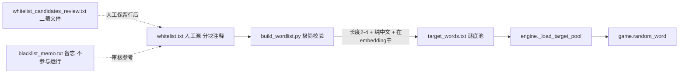

## 用户需求

将谜底候选池从「黑名单过滤」机制彻底重构为「白名单收录」机制，从根本上杜绝涉政 / 涉军 / 涉黄 / 复合词 / 短语残词的渗入。

## 产品概述

放弃「jieba 全量 + 复杂黑名单」路线，改为「人工维护白名单 → 极简校验 → 输出谜底池」的单向收录管道。最终白名单由「现有 seed_whitelist.txt（已精选 ~880 词）」+「从旧 target_words.txt 8000 词中按品类初筛 → 用户人工二筛后并入的新词」构成，目标 ≥ 1000 词，仅在 embedding 中存在的词才会出现在谜底里。

## 核心特性

- **白名单单源**：`whitelist.txt` 是唯一可信源，按品类分块用 `#` 注释组织，可读可审；其它任何词都不会进入谜底
- **agent 初筛 + 用户二筛 双闸门**：agent 把旧 target_words.txt 按品类初筛产出 `whitelist_candidates_review.txt`（一行一词、按品类分块），用户在该文件中保留满意的词、删掉不满意的词，复跑构建脚本即可并入正式白名单
- **极简构建脚本**：`build_wordlist.py` 仅做四件事——读 whitelist / 跳过 # 注释 / 校验长度 ∈ [2,4] 与纯中文 / 校验在 embedding 中存在 → 输出 target_words.txt；不再依赖 jieba、不再涉及任何黑名单过滤
- **黑名单备忘留底**：把现有 bad_words / place_blacklist / person_blacklist / 敏感关键词正则的核心词归档到一份 `blacklist_memo.txt`，仅作"审核白名单时的参考清单"，运行期与构建期都不读取
- **运行期零侵入**：`engine.py` 仍读 `target_words.txt`，常量与加载逻辑全部不动，热重载即生效

## 技术栈

- 沿用项目既有栈：Python 3.12 + gensim KeyedVectors + FastAPI
- 构建脚本**移除 jieba 依赖**（运行期本来就不依赖 jieba，本次构建期也不再需要），requirements-dev.txt 同步精简
- 全部离线、无外部网络依赖

## 总体方案

### 1. 数据流（单向、可审计）



### 2. 白名单生成两阶段

**阶段 1（agent 自动）**：从旧 `target_words.txt` 8000 词剔除已在 seed_whitelist 的部分，再按以下硬规则机筛：

- 长度 ∈ [2, 4]
- 纯中文
- 命中现有 `bad_words.txt` / `place_blacklist.txt` / `person_blacklist.txt` / 敏感关键词正则中**任一**则剔除
- 命中"复合词 / 残词"启发式（含"性 / 化 / 度 / 率 / 化学 / 工业 / 经济 / 主义 / 人士 / 人员 / 部门 / 大学 / 学院 / 银行 / 公司 / 集团 / 委员 / 委员会 / 工会 / 协会 / 会议 / 全会 / 战争 / 部队 / 军" 等子串）则剔除
- 命中"成语 / 四字短语"启发式（4 字且不在常见名词白名单内）→ 进低优先桶
- 剩余词按"是否疑似具象名词"分桶到食品 / 动植物 / 自然 / 物品 / 抽象事物 / 其它 等品类，输出 `whitelist_candidates_review.txt`，每行一个候选词，分块注释组织

**阶段 2（用户人工）**：用户直接在 `whitelist_candidates_review.txt` 上**删除不要的行**（保留要的行），保存即生效；构建脚本会把"该文件剩余词 ∪ seed_whitelist.txt 现有词"并入 `whitelist.txt`，并去重 + 写出 `target_words.txt`

> 注：阶段 2 是**用户的活**，本次任务只完成"agent 初筛产物 + 自动并入逻辑"，把决策权完整交给用户

### 3. 极简构建脚本（≤100 行）

```python
# 伪代码
def main():
    seed = load_lines("data/whitelist.txt")           # 旧 seed + 二筛通过的新词，已合并
    review = load_lines("data/whitelist_candidates_review.txt")  # 用户二筛后剩余的词
    raw = sorted(set(seed) | set(review))             # 并集去重，按字典序稳定输出
    kept, drops = [], Counter()
    engine = get_engine()
    for w in raw:
        if not (2 <= len(w) <= 4):     drops["len"] += 1; continue
        if not is_pure_chinese(w):     drops["non_cn"] += 1; continue
        if not engine.has(w):          drops["not_in_kv"] += 1; continue
        kept.append(w)
    write_target_words(kept)           # 首行 # generated at..., 其余一行一词
    run_self_check(kept)               # PROBE_LIVING / PROBE_NEW / PROBE_PROPER 命中率
                                       # PROBE_NEGATIVE / PROBE_NEGATIVE_HARD / 用户新吐槽 27 词 0 命中
```

### 4. 自验收（沿用 + 加固）

- 正样本（必须命中）：`PROBE_LIVING`（~78 词）≥ 95%、`PROBE_NEW`（12 词）≥ 90%、`PROBE_PROPER`（9 词）≥ 85%
- 负样本（必须 0 命中）：`PROBE_NEGATIVE` + `PROBE_NEGATIVE_HARD` + **本轮新增 `PROBE_USER_FEEDBACK`**（27 词，来自用户最新吐槽）
- 任一 FAIL 则非零退出

## 实施要点（Implementation Notes）

- **白名单合并语义**：`whitelist.txt` 是"长期人工源"；`whitelist_candidates_review.txt` 是"待并入候选"。脚本每次跑都把后者剩余词追加进前者后排重 → 这样用户每次只删行不必跨文件腾挪。第一次执行后给出一段 README 说明，避免误删
- **去重稳定**：合并写出时按字典序排序，diff 友好，便于 review
- **embedding 校验保留警告**：被踢出的词集中打印（按品类）一次，便于发现"明明很常见却不在 embedding"的词，方便日后换更大 embedding 时回收
- **runtime 零变更**：engine.py / game.py / wordlist.py 全部不动，避免引入回归
- **黑名单备忘**：`blacklist_memo.txt` 用 `#` 大块注释组织成 6 类（副词残词 / 政治军事 / 地缘地名 / 政治人物 / 涉黄涉暴 / 抽象后缀模式），在文件首部写"⚠️ 本文件不参与运行，仅供白名单审核者参考"
- **删除范围控制**：只删数据文件、不删 `app/wordlist.py`（已废弃的兼容模块，删它无收益且增加 blast radius）

## 目录结构

```
backend/
├── app/
│   ├── engine.py                 # 不动（TARGET_POOL_FILE 已是 target_words.txt，加载逻辑已兼容 # 注释）
│   ├── game.py                   # 仅 1 处 docstring 注释顺带刷新（可选）
│   └── wordlist.py               # 不动（已废弃的兼容模块，注释已说明）
├── data/
│   ├── whitelist.txt             # [NEW] 长期人工源 = 现 seed_whitelist.txt 内容直接迁过来；增删都改这里
│   ├── whitelist_candidates_review.txt  # [NEW] agent 从旧 target_words 初筛产出的候选清单，分块注释组织；用户在此文件上做二筛（删行）
│   ├── target_words.txt          # [REGEN] 由新版 build_wordlist.py 重新生成（≥1000 词）
│   ├── blacklist_memo.txt        # [NEW] 合并 bad_words/place_blacklist/person_blacklist + 敏感关键词，6 类分块注释，首部写"仅作参考、不参与运行"
│   ├── seed_whitelist.txt        # [DELETE] 内容已迁入 whitelist.txt
│   ├── bad_words.txt             # [DELETE] 核心词已迁入 blacklist_memo.txt
│   ├── place_blacklist.txt       # [DELETE] 内容已迁入 blacklist_memo.txt
│   ├── person_blacklist.txt      # [DELETE] 内容已迁入 blacklist_memo.txt
│   ├── embedding.kv              # 不动
│   ├── embedding.kv.vectors.npy  # 不动
│   └── light_Tencent_AILab_ChineseEmbedding.bin  # 不动
├── scripts/
│   └── build_wordlist.py         # [REWRITE] ≤100 行极简版：读 whitelist + review → 长度/纯中文/embedding 三重校验 → 写 target_words.txt + 跑自验收
├── requirements-dev.txt          # [MODIFY] 删除 jieba==0.42.1（构建期不再需要）
└── README.md                     # [MODIFY] 改写"2.1 重新构建谜底候选池"段落，描述新数据流与人工二筛工作流
```

## 关键代码结构

```python
# backend/scripts/build_wordlist.py 主要常量与签名

WHITELIST_PATH = DATA_DIR / "whitelist.txt"
REVIEW_PATH    = DATA_DIR / "whitelist_candidates_review.txt"
OUT_PATH       = DATA_DIR / "target_words.txt"
MIN_LEN, MAX_LEN = 2, 4

def load_lines(path: Path) -> list[str]: ...    # 跳过 # 注释 / 空行 / 仅取首列

def validate(word: str, has_in_kv) -> tuple[bool, str]: ...
                # 返回 (是否保留, 拒绝原因 in {"len","non_cn","not_in_kv"})

def merge_review_into_whitelist(whitelist_words: list[str], review_words: list[str]) -> list[str]:
    # 把 review 中通过校验的词追加进 whitelist 文件尾部"# === 来自 review 的并入词 ==="区块；
    # 已存在的词跳过；返回合并后的全集（用于本次输出 target_words.txt）

def run_self_check(final: set[str]) -> bool: ...    # PROBE_USER_FEEDBACK 等三组负样本
```